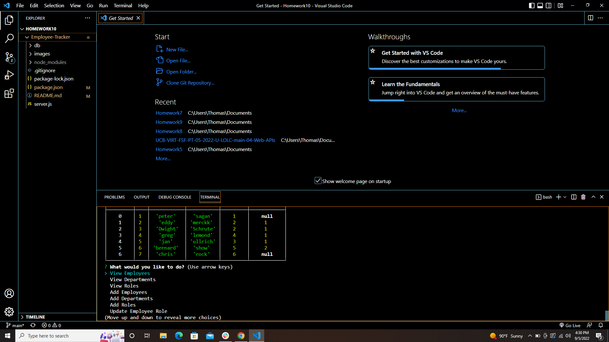

# SQL: Employee Tracker

[Link](https://drive.google.com/file/d/1VNTXPv9Fgr51BtUgJNZy8jErjT7Yjx5x/view)

## Description 

  This interface is called **content management systems (CMS)**.  this  is  a command-line application  to manage a company's employee database, using Node.js, Inquirer, and MySQL.

## Uses

  A business owner wants to be able to view and manage the departments, roles, and employees in the company
so that the user can organize and plan the  business
This is  a command-line application that accepts user input.
when the user start the applicationthen the user presented with the following options: 
view all departments, 
view all roles, 
view all employees, 
add a department, 
add a role, 
add an employee, and update an employee role.
when the user choose to view all departments
thenthe user presented with a formatted table showing department names and department ids
when the user choose to view all roles
then the user presented with the job title, role id, the department that role belongs to, and the salary for that role
when the user choose to view all employees
then the user presented with a formatted table showing employee data, including employee ids, first names, last names, job titles, departments, salaries, and managers that the employees report to
when the user choose to add a department,then the user prompted to enter the name of the department and that department is added to the database
when the user choose to add a role,then the user prompted to enter the name, salary, and department for the role and that role is added to the database
when the user choose to add an employee,the the user prompted to enter the employee’s first name, last name, role, and manager, and that employee is added to the database
when the userchoose to update an employee role,then the user prompted to select an employee to update and their new role and this information is updated in the database 

